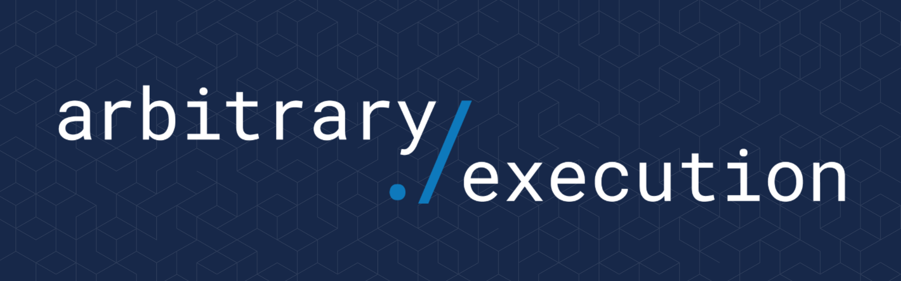

# Publications from Arbitrary Execution

* [Security Assessments](#security-assessments)
* [Presentations](#presentations)

## Security Assessments

Arbitrary Execution performs private and public security assessments. Reports we are allowed to share can be found here.

### Smart Contracts

| Product / Protocol | Review Date | Announcement |
| --- | --- | --- |
| [Automata](https://automata.fi) | December 21, 2021 | |
| [Gamma](https://www.gamma.xyz) | [March 9, 2022](assessments/Gamma_20220309.pdf) | [Gamma's v2 Smart Contract Audit](https://medium.com/gamma-strategies/gammas-v2-smart-contract-audits-completed-by-consensys-diligence-arbitrary-execution-29004e6b63c3) |
| [Milkomeda](https://www.milkomeda.com/) | [March 23, 2022](assessments/Milkomeda_20220421.pdf) | [Our first audit with @Arbitrary_Exec](https://twitter.com/Milkomeda_com/status/1507885719242653697) |
| [Laser Wallet](https://github.com/laser-wallet/laser-wallet-contracts) | [April 21, 2022](assessments/LaserWallet_20220323.pdf) | |
| [Milkomeda](https://www.milkomeda.com/) | [August 19, 2022](assessments/Milkomeda_20220819.pdf) | |
| [Sentiment Oracle and Controller](https://sentiment.xyz) | [July 27, 2022](assessments/Sentiment_Oracle_20220727.pdf) | |
| [Sentiment Core Protocol](https://sentiment.xyz) | [July 27, 2022](assessments/Sentiment_Protocol_20220727.pdf) | |
| [Aztec](https://aztec.network/) | [October 14, 2022](assessments/Aztec_20221014.pdf) | |
| [Milkomeda](https://www.milkomeda.com/) | [October 14, 2022](assessments/Milkomeda_20221014.pdf) | |
| [The Box](https://www.decent.xyz) | [July 5, 2023](assessments/Decent_20230705.pdf) | |
| [Premia](https://premia.finance/) | [August 17, 2023](assessments/Premia_20230817.pdf) | |

## Presentations

| Title | Location | Author(s) | Recording |
| --- | --- | --- | --- |
| [Hacking Smart Contracts With Mainnet Forking](presentations/Hacking%20Smart%20Contracts%20With%20Mainnet%20Forking/hacking_smart_contracts_with_mainnet_forking.pdf) | Off The Chain Conference 2022 | Darian Chan | [Livestream Replay](https://youtu.be/RKNPyDGWIrM?t=4851) |
| Announcing the Web3 SDLC: Secure Development Lifecycle | ETHDenver 2022 | Philip Gillett | [Presentation](https://www.youtube.com/watch?v=d5wvO7v5-YA)